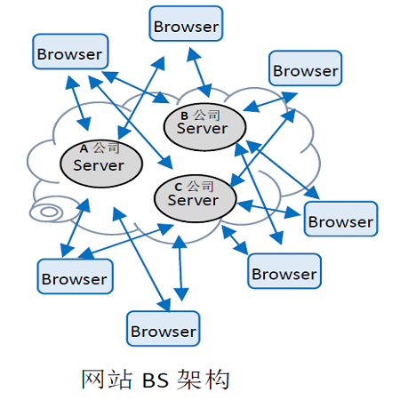
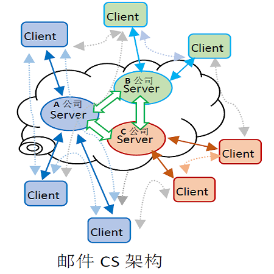
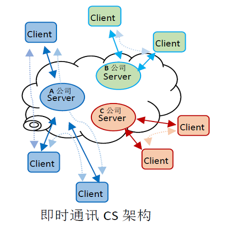
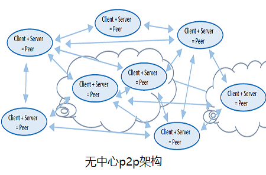

## 互联网架构的发展史

### 这个听起来似乎有点理想化的信息社会。大家不禁会说，怎么可能，让大家接受并使用同一个通讯协议的软件！然而，纵观互联网的发展历史，这个理想的p2p通讯社会也不是不可能实现的。
> 早期的互联网，一直延续到现在还在广泛使用的，就是基于http-html协议的Browser-Server架构。这是几乎所有个人电脑和智能手机都支持的信息获取方式，也是大家都遵守的通讯协议。 Server通常由公司或组织运营，允许众多的Browser终端设备连上来浏览观看。BS架构基本上是“一对多”的方式发布信息，方便信息的传播，但不方便人与人互动交流，受到server的管控和限制。微博、淘宝、百度等网站平台，基本上还是属于BS架构的系统。


### BS架构的各家服务器各自独立，各个终端浏览器之间基本无法交流信息，多为查询信息或发表文章使用

> 自从互联网诞生，到现在还一直沿用的电子邮件，基本上属于Client-Server架构，通讯协议是开放的smtp/pop3/IMAP，相比较BS架构多了Server与Server之间的互联互通，Client与Client之间是双向平等交流。基本上所有平台都支持电子邮件的收发。
  

### CS架构的电子邮件系统服务器之间相互连接，个人邮箱隶属于各家公司，不能迁移，各个邮箱之间可以相互收发信息。

> 后来ICQ、QQ、Skype、微信等即时通讯工具出现，也是Client-Server的架构，但私有化了通讯协议。即时通讯看似人与人之间直接互动，但需要Server管理和交换数据作用，仍然存在管控和限制。由于通讯协议是私有的，存在运营的垄断性。滴滴、Uber、摩拜等，本质上都是CS架构。
  

### CS架构的即时通讯系统服务器之间相互不连接，个人帐号隶属于各家公司，不能迁移，不同公司的帐号之间不可以相互收发信息。

### 如果将BS或CS架构中的Server不断自由增加，做到人人都拥有一个自己的Server，运行于个人电脑上，Server和Browser/Client同一软件(Peer)，则变成点对点直接通讯和分布式的计算和存储了，使用开放的通讯协议，不再私有化，不再有垄断的管理服务器。只是http-html或smtp/pop3/IMAP协议或许过于低效不再合适、域名和IPV4公网IP也许不够用、通讯也不够安全和可靠，需要一个新的开放并开源的协议来解决这些问题。这个就是诞生了基于开放协议无中心p2p的通讯系统！
  

### p2p架构的Peer之间相互连接收发信息，个人帐号不隶属于任何公司，可自由迁移和使用第三方网络服务，。

> 无中心服务器的p2p通讯，与电子邮件及微信/QQ等最大的区别是：通过开放协议无需中心管理服务器而互连互通。每个人不再注册在某个服务器上而依附于某家公司，不再受其管制约束。每个人拥有一个或多个全球唯一ID；有自己掌握的信息存储和计算能力，基于自己私人的硬件设备或是租用第三方的云服务；大家遵循同一个开放的通讯协议；在信息拥有者的授权范围内，可以在网络世界自由访问别人，同时也可以被别人自由访问；每个ID不绑定公网IP或固定域名。联络某个人，通过中间人一个接一个问的方式，或者向双方约定的任何一个提供地址交换服务的第三方查询对方IP地址。

```
$ 人人平等，世界和平；
```

```
$ 合久必分，分久必合；
```

[回到主页](http://jamesfan007.github.io/)

---

#### 原创声明：

##### 所有文章均为原创。 <br/> 如果引用，必标明出处；若为转贴，定附上链接。

###### 作者：James Van <br/> 链接：http://jamesfan007.github.io/ <br/> 代码：https://github.com/jamesfan007/jamesfan007.github.io <br/> 联系：mail:[jamesfan007@hotmail.com]  <br/> &emsp;&emsp;&emsp;wechat:[CleverDogMaster]

---
