## 什么叫数学信任？

#### 信息安全一直是人们关心的问题，包含窃取、伪造、冒充等常见问题。基于数学原理的非对称加密算法数字签名(例如RSA)可以解决“谁提供的信息”和“谁可以看信息”困扰。 而数字水印等技术的可追溯性，可以一定程度上威慑解密后的文档图片影像信息传播。指纹、语音、人脸、肢态、操作习惯等生物识别算法可以将某个人和某个设备关联起来，存储介质里数字痕迹、周围无线电信号特征、地理位置轨迹等能将某个设备和某个唯一ID关联起来，这些基于一个个数学算法的特征识别技术，有利于辨别行为实施人是谁，谁在创造信息，谁在查看信息。

#### 信息安全还包含，不被人为删除封禁、不被噪声干扰破坏、不因介质消退而灭失、不被海量信息淹没、不因遗忘而难以查找等问题。这些也可以通过数学算法强化和对抗：加密和分布式扩散存储对抗查禁删除灭失问题，水印冗余和多跳p2p传输对抗封杀拦截问题，HASH特征提取和分类技术协助检索查找等等。

#### “In Math We Trust”，用数学手段增强人与人之间的信任。区块链就是一个数学信任的例子：比特币不可伪造；分布式存储，添加的信息不可删除。

#### 数学信任主要解决的是信息“谁提供的，可以给谁”问题。

### RSA数字签名原理

#### RSA可以保证信息是谁的，不可抵赖不是他的；可以保证只给谁看，别人不可窃看。

#### 非对称加密 '数字签名'（digital signature）和'数字证书'（digital certificate）

1. 鲍勃有两把钥匙(一对密钥)，一把是公钥(Public key)向外界公开，另一把是私钥(Private key)自己妥善保留保密。两个密钥之间存在着相互依存关系：即用其中任一个密钥加密的信息只能用另一个密钥进行解密。其中加密密钥不同于解密密钥，"公钥加密私钥解密"，反之也可"私钥加密公钥解密"。这个在RSA算法中靠欧拉公式来保证。

   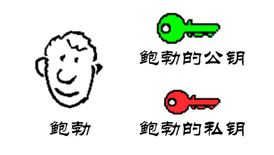

2. 鲍勃把公钥送给他的朋友们----帕蒂、道格、苏珊----每人一把。

   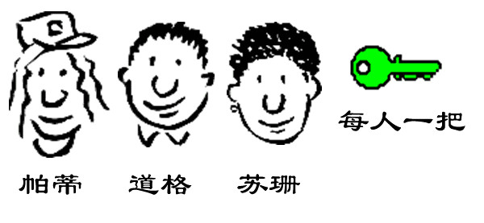

3. 苏珊要给鲍勃写一封保密的信。她写完后用鲍勃的公钥加密，就可以达到保密的效果。

   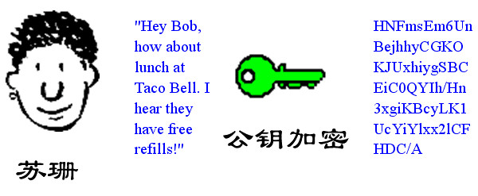

4. 鲍勃收信后，用自己的私钥解密，就看到了信件内容。这里要强调的是，只要鲍勃的私钥不泄露，这封信就是安全的，即使落在别人手里，也无法解密。

   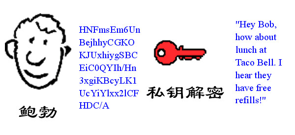

5. 鲍勃给苏珊回信，决定采用'数字签名'。他写完后先用Hash函数，生成信件的摘要（digest）。Hash哈希函数就是把任意长度的输入通过散列算法变换成唯一的固定长度的输出值。完全不可能从Hash值来还原出输入内容。很难但有可能通过拼凑输入内容来输出指定的Hash值。不同输入的若得到了相同的Hash值，称为"Hash碰撞"。

   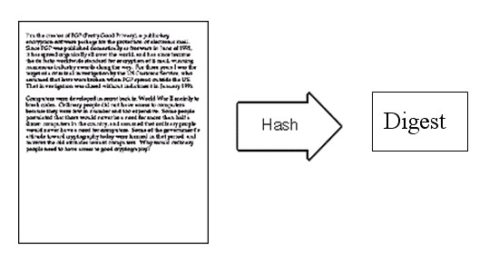

6. 然后，鲍勃使用私钥，对这个摘要加密，生成'数字签名'（signature）。

   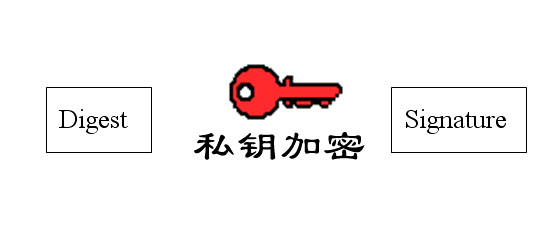

7. 鲍勃将这个签名，附在信件下面，一起发给苏珊。

   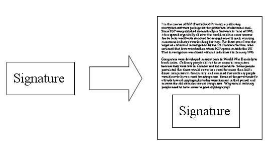

8. 苏珊收信后，取下数字签名，用鲍勃的公钥解密，得到信件的摘要。由此证明，这封信确实是鲍勃发出的。

   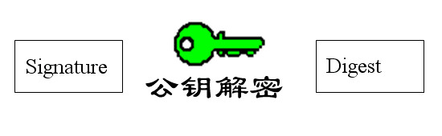

9. 苏珊再对信件本身使用Hash函数，将得到的结果，与上一步得到的摘要进行对比。如果两者一致，就证明这封信未被修改过。

   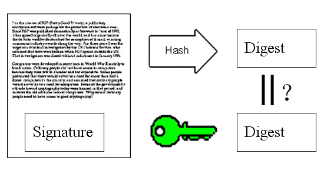

10. 复杂的情况出现了。道格想欺骗苏珊，他偷偷使用了苏珊的电脑，用自己的公钥换走了鲍勃的公钥。此时，苏珊实际拥有的是道格的公钥，但是还以为这是鲍勃的公钥。因此，道格就可以冒充鲍勃，用自己的私钥做成'数字签名'，写信给苏珊，让苏珊用假的鲍勃公钥进行解密。

    

11. 后来，苏珊感觉不对劲，发现自己无法确定公钥是否真的属于鲍勃。她想到了一个办法，要求鲍勃去找'证书中心'（certificate authority，简称CA），为公钥做认证。证书中心用自己的私钥，对鲍勃的公钥和一些相关信息一起加密，生成'数字证书'（Digital Certificate）。

    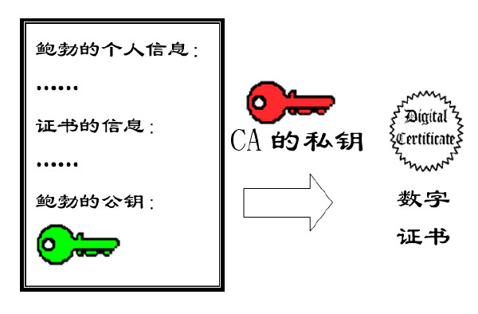

12. 鲍勃拿到数字证书以后，就可以放心了。以后再给苏珊写信，只要在签名的同时，再附上数字证书就行了。

    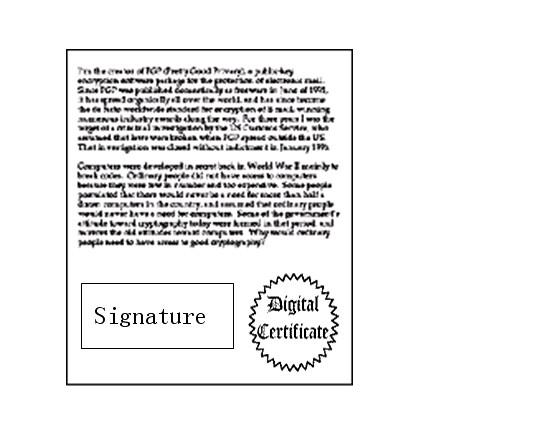

13. 苏珊收信后，用CA的公钥解开数字证书，就可以拿到鲍勃真实的公钥了，然后就能证明'数字签名'是否真的是鲍勃签的。

    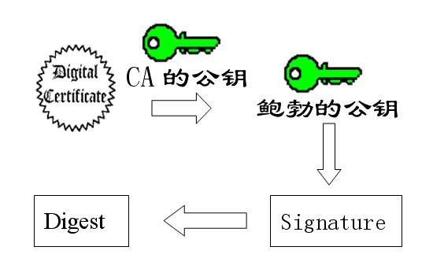

#### RSA密钥组成与加解密公式

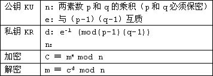

> 欧几里得的证明，每个数只有一种质因数分解，这可以考虑为一对密钥。对大整数进行因式分解，是一件很困难的事情，目前只有用暴力破解，就是一个一个去试。目前已知，被破解最长RSA密钥是768个二进制位。就是说，长度超过768位的密钥，还没有被人破解。因此可以认为，1024位的RSA密钥基本安全，2048位的密钥极其安全。

[RSA算法详细解释](https://www.cnblogs.com/cjm123/p/8243424.html)

### 数字水印（Digital Watermarking）

> 数字水印技术是将一些标识信息（即数字水印）直接嵌入数字载体当中（包括多媒体、文档、软件等）或是间接表示（修改特定区域的结构），且不影响原载体的使用价值，也不容易被探知和再次修改。但可以被生产方识别和辨认。通过这些隐藏在载体中的信息，可以达到确认内容创建者、购买者、传送隐秘信息或者判断载体是否被篡改等目的。数字水印是保护信息安全、实现防伪溯源、版权保护的有效办法，是信息隐藏技术研究领域的重要分支和研究方向。
> 
> 数字水印技术基本上具有下面几个方面的特点：
> 
> * 安全性(Security)：数字水印的信息应是安全的，难以篡改或伪造，同时，应当有较低的误检测率，当原内容发生变化时，数字水印应当发生变化，从而可以检测原始数据的变更；当然数字水印同样对重复添加有很强的抵抗性；
> 
> * 隐蔽性(Invisibility)：数字水印应是不可知觉的，而且应不影响被保护数据的正常使用；不会降质；
> 
> * 鲁棒性(Robustness)：该特性适用于鲁棒水印。是指在经历多种无意或有意的信号处理过程后，数字水印仍能保持部分完整性并能被准确鉴别。可能的信号处理过程包括信道噪声、滤波、数/模与模/数转换、重采样、剪切、位移、尺度变化以及有损压缩编码等；
> 
> * 敏感性(Sensitivity)：该特性适用于脆弱水印。是经过分发、传输、使用过程后，数字水印能够准确的判断数据是否遭受篡改。进一步的，可判断数据篡改位置、程度甚至恢复原始信息。

#### 举个数字水印技术例子来说，某家电影院里正在播放新上映的大片，有人拿摄像机翻拍。通过分析翻拍的录像画面里，隐藏的不为人眼察觉的细微特征(对电影节目画面来说是干扰噪声)，可以追溯到是什么时候在哪台数字放映机放映时翻拍的。

#### 再举个例子，有人对着公司电脑的显示屏，将内部机密邮件用手机拍下来，也同样可能通过隐藏在屏幕画面的不为人眼察觉的细微特征，追溯到是什么时候，哪台电脑上偷拍的。

[回到主页](http://jamesfan007.github.io/)

---

#### 原创声明：

##### 所有文章均为原创。   如果引用，必标明出处；若为转贴，定附上链接。

###### 作者：James Van   链接：http://jamesfan007.github.io/   代码：https://github.com/jamesfan007/jamesfan007.github.io   联系：mail:[jamesfan007@hotmail.com]    &emsp;&emsp;&emsp;wechat:[CleverDogMaster]

---
