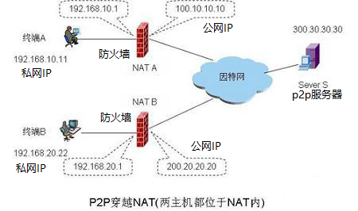

## 这里的p2p指的是什么？

#### 大家熟悉的p2p金融借贷、区块链比特币、p2p/BT下载、p2p网络穿透和分布式计算都是叫"p2p",都包含点对点(peer to peer)的意思。

#### 在这里讲的"p2p"，可不是骗钱的私人借贷p2p(如今"p2p"名词都被玩坏了！)。

#### 在这里讲的也不是区块链/p2p的比特币，尽管技术原理上有类似的地方。

#### 这里要讲的p2p，和IPv4的防火墙网络穿透的p2p技术有关，也和p2p下载有关，但不限于技术层面。

#### 一般的p2p指peer-to-peer。这里的p2p还包含person-to-person，partner-to-partner的更高层意思。

#### 在这里讲的p2p是指每个人都拥有一个既是服务器又是终端机的通讯设备pear，使用开源开放通讯协议，可以人与人之间，直接点对点通讯。分布式计算和存储，无需中心服务器管理。不受某个公司或某家软件操控限制的通讯方式。

#### p2p主要解决的是信息“从哪里来，到哪里去”的问题。

### p2p技术漫谈...(IoT、IPC、云存储、云计算与分布式计算)

> IoT（Internet Of Things）物联网,IPC（ip Camera）网络摄像机
> p2p (Peer to Peer）有几个概念，有指分布式下载与上传技术，例如BT下载技术。早期服务器的网络带宽不高，无法满足大家同时下载，更不用说直播。于是大家接力分享，相互下载。
> 现在p2p也指个人直接与个人之间借贷的平台，即所谓的p2p借贷，也可以认为是person to person。
> 本文中的含义是指对等网络，或对等连接。与前者接近或类似，但不完全一样。BT的p2p重点在内容；这里重点在连接。是指网络穿透和relay转发技术的综合。
> 
> IoT/IPC为什么要p2p技术？
> 归根结底，当初制定的互联网IPv4的标准没有想到那么多东西/设备都要上网，4个byte的IP地址不够用！后来才有更强的IPv6标准，你想将世界上的任何一粒沙子分配一个地址都行。然而想直接升级为IPv6标准，不行!因为太多现有的路由器，交换机等网络设备是IPv4的，没法大家说好一起更新换代。
> 
> 于是出现了动态IP地址分配技术。临时要上网的设备分配一个IP地址，不上网了就收回，例如ADSL。与此对应的，则有DDNS技术出现，即动态域名解析。尽管设备IP地址会变化，但域名不变.相当于有人手上有本花名册，将你的名字与你经常变更的地址关联起来。著名的”花生壳”就是DDNS服务商。很多海康，大华等公司也有自己的私有协议提供这样DDNS服务，负责告诉客户，你家摄像头的实际IP地址。让你的手机能看到它们。
> 
> IP地址不够用，还有另外一种解决办法，就是通过防火墙将互联网分割成一个个局域网，局域网内用私有IP,这样就同时重复IP使用，不怕”重名”了。但这样有个不便的地方，就是私网内设备只能看到公网的服务器和取回信息，公网的服务器无法主动访问私网内设备，两个私网之间的设备更是无法直接看到对方。于是出现了网络NAT（Network Address Translator）穿透技术，利用路由器的一些端口映射关系来打洞，让两个私网之间的设备直接看到对方。
> 
> 
> 然而，路由器的设计不完全一样，无法保证一定成功打洞，于是出现了一些中继的服务器，放在公网，负责将一个私网设备的消息转给另一个私网设备。P2p技术就是这样一些技术的综合应用。这时服务器可以不负责存储，只负责建立设备间相互连接，比较轻松。即时通信skype就是典型例子。TUTK的核心也是这样技术协议/平台。
> 
> IPC或IoT的设备产生的录像等信息，需要有地方保管和管理，于是出现了云存储，还有人希望能自动分析和统计出大数据，例如根据某个摄像上传的图像，分析统计报告海关出入口人流量，交通监控中自动追踪某个车牌的车辆，于是用到"云计算"。然而有人觉得东西存在一个地方不好，出现了"分布式存储"，又有人觉得摄像头自己也可以做一些智能影像分析，出现了"分布式计算"。而真正的分布式存储和计算是能够不限定不关心某个特定具体设备，将一个个小设备联合起来，处理一个大任务/数据。这就是p2p技术！
> 
> 云计算与分布式计算是矛盾又统一的整体。云计算本身应用到了分布式计算技术。
> p2p通讯，通常还是依赖于某个穿透管理的中心服务器。如果不依赖于特定一台服务器，就成为无中心的p2p通讯。

```
人人平等，世界和平
```

[回到主页](http://jamesfan007.github.io/)

#### 原创声明：

##### 所有文章均为原创。如果引用，必标明出处；若为转贴，定附上链接。

---

###### 转载请注明作者和出处：http://jamesfan007.github.io/

###### 代码地址：https://github.com/jamesfan007/jamesfan007.github.io

###### 作&emsp;&emsp;者：James Van

###### 联系方式：mail:[jamesfan007@hotmail.com] wechat:[CleverDogMaster]

---
