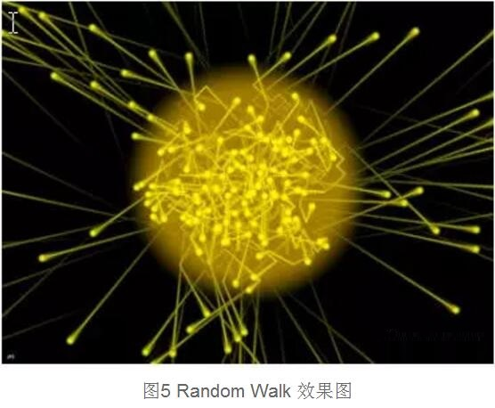

## p2p网络的搜索技术
##### 文章转自"区块链大师"

### DHT网络(结构化P2P网络)的搜索技术
> DHT全称叫分布式哈希表(Distributed Hash Table)，是一种分布式存储方法.  

#### 网络链路长度与度的关系

##### 基于分布式Hash表的P2P系统包括CAN, Pastry, Tapestry ,Chord等，它们的路由和查询方法前面已经作介绍，这里不再赘述。这些系统建立在确定性拓扑结构的基础上，从而表现出对网络中路由的指导性和网络中结点与数据管理的较强控制力。但是，对确定性结构的认识又限制了搜索算法效率的提升。研究分析了目前基于DHT的搜索算法，发现衡量搜索算法的两个重要参数度数（表示节点的邻居关系数）和链路长度（搜索算法的平均路径长度）之间存在渐进曲线的关系，如图1所示。

  

##### 在N个结点网络中，图中直观显示出当度数为N时，搜索算法的直径为O(1)；当每个结点仅维护一个邻居时，搜索算法的直径为O(N)。这是度数和直径关系的两种极端情况。同时，研究分析了O(d)的度和O(d)的直径的算法是不可能的。

##### 从渐进曲线关系可以看出，如果想获得更短的路径长度，必然导致度数的增加；而网络实际连接状态的变化造成大度数邻居关系的维护复杂程度增加。另外，研究者证明O(logN)甚至O(logN/loglogN)的平均路径长度也不能满足状态变化剧烈的网络应用的需求。新的搜索算法受到这种折衷关系制约的根本原因在于DHT对网络拓扑结构的确定性认识。

#### 语义查询和DHT的矛盾

##### 现有DHT算法由于采用分布式散列函数，所以只适合于准确的查找，如果要支持目前Web上搜索引擎具有的多关键字查找的功能，还要引入新的方法。主要的原因在于DHT的工作方式。

##### 基于DHT的P2P系统采用相容散列函数根据精确关键词进行对象的定位与发现。散列函数总是试图保证生成的散列值均匀随机分布，结果两个内容相似度很高但不完全相同的对象被生成了完全不同的散列值，存放到了完全随机的两个结点上。因此，DHT可以提供精确匹配查询，但是支持语义是非常困难的。

##### 目前在DHT基础上开展带有语义的资源管理技术的研究还非常少。由于DHT的精确关键词映射的特性决定了无法和信息检索等领域的研究成果结合，阻碍了基于DHT的P2P系统的大规模应用。

### 非结构化P2P网络的搜索技术

#### 小世界模型(Small World)对P2P搜索技术的影响

##### 非结构化P2P搜索技术一直采用洪泛转发(Flooding)的方式，与DHT的启发式搜索算法相比，可靠性差，对网络资源的消耗较大。最新的研究从提高搜索算法的可靠性和寻找随机图中的最短路径两个方面展开。也就是对重叠网络(Overlay Network)的重新认识。其中，小世界模型特征和幂规律证明实际网络的拓扑结构既不是非结构化系统所认识的一个完全随机图，也不是DHT发现算法采用的确定性拓扑结构。实际网络体现的幂规律分布的含义可以简单解释为在网络中有少数结点有较高的“度”，多数结点的“度”较低。度较高的结点同其他结点的联系比较多，通过它找到待查信息的概率较高。

##### Small world模型的特性：网络拓扑具有高聚集度和短链的特性。在符合Small World特性的网络模型中，可以根据结点的聚集度将结点划分为若干簇(Cluster)，在每个簇中至少存在一个度最高的结点为中心结点。大量研究证明了以Gnutella为代表的P2P网络符合Small World特征，也就是网络中存在大量高连通结点，部分结点之间存在“短链”现象。

  

##### 因此，P2P搜索算法中如何缩短路径长度的问题变成了如何找到这些“短链”的问题。尤其是在DHT搜索算法中，如何产生和找到“短链”是搜索算法设计的一个新的思路。Small World特征的发现和引入会对P2P搜索算法产生重大影响。

#### 非结构化P2P搜索算法

##### 按照搜索策略，可以分为两大类：盲目搜索和启发式搜索。盲目搜索通过在网络中传播查询信息并且把这些信息不断扩散给每个节点。通过这种洪泛方式来搜索想要的资源。而启发式搜索在搜索的过程中利用一些已有的信息来辅助查找过程。由于信息搜索对资源的存储有一些知识，所以信息搜索能够比较快的找到资源。

* **Flooding 搜索方法**  

  在最初的Gnutella协议中，使用的是Flooding方法，在网络中，每个节点都不知道其他节点的资源。当它要寻找某个文件，把这个查询信息传递给它的相邻节点，如果相邻节点含有这个资源，就返回一个QueryHit的信息给Requester。如果它相邻的节点都没有命中这个被查询文件，就把这条消息转发给自己的相邻节点。这种方式像洪水在网络中各个节点流动一样，所以叫做Flooding搜索。由于这种搜索策略是首先遍历自己的邻接点，然后再向下传播，所以又称为宽度优先搜索方法（BFS）。如图所示：搜索的节点一开始TTL=3，它每传播一次TTL减1，如果TTL减到0还没有搜索到资源，则停止。如果搜索到资源则返回目标机器的信息以用来建立连接。在搜索过程中可能出现循环，但是由于有TTL控制，所以这个循环不会永远进行下去，当TTL=0的时候自然结束。 

    
* **Modified-BFS方法**  

  这种方法是在宽度优先方法Flooding上面作了一定修改。跟Flooding搜索方法不同，搜索源只是随机的选取一定比例的相邻节点作为查询信息的发送目标，而不是发送给所有相邻节点。相比于Flooding方法来说，是以时间换取空间的有效尝试。 
* **Iterative Deepening搜索方法**  

  迭代递增是Flooding方法的改进，策略循环递增TTL（Time to Live）值，这个值用来控制Flooding的搜索深度。跟Flooding搜索方法给TTL赋一个较大的值不同，这种方法在初始阶段，给TTL一个很小的值，如果在TTL减为0，还没有搜索到资源，则给TTL重新赋更高的值。这种策略可以减少搜索的半径，但是在最坏的情况下，延迟很大，如果P2P网络内重复资源丰富，这种方法在不影响搜索质量的基础上将减少网络内的查询流量，在有的文献中亦称为Expanding Ring（扩展环搜索）。  

    
* **Random Walk搜索方法**  

  在随机漫步中，请求者发出K个查询请求给随机挑选的K个相邻节点。然后每个查询信息在以后的漫步过程中直接与请求者保持联系，询问是否还要继续下一步。如果请求者同意继续漫步，则又开始随机选择下一步漫步的节点，否则中止搜索。 
* **Gnutella2的搜索方法**  

  Gnutella2建立Super-Node,它存储着离它最近的叶子节点的文件信息，这些SuperNode,再连通起来形成一个Overlay Network.当叶子节点需要查询文件，它首先从它连接的SuperNode的索引中寻找，如果找到了文件，则直接根据文件所存储的机器的IP地址建立连接，如果没有找到，则SuperNode把这个查询请求发给它连接的其他超级节点，直到得到想要的资源,KaZaa，POCO等都是基于这种超级节点的思想。  

    
* **基于移动Agent的搜索方法**  

  移动Agent是一个能在异构网络中自主地从一台主机迁移到另一台主机，并可与其他Agent或资源进行交互的程序。Agent非常适合在网络环境中来帮助用户完成信息检索的任务。现在意大利的一些研究人员在移动 Agent 结合P2P方面做了一些前沿的研究，其中的一些想法，就是通过在P2P软件中嵌入Agent的运行时环境。当有节点需要搜索的时候，它发送一个移动Agent 给它相邻的节点，移动Agent记录着它的一些搜索的信息。当这个Agent到达一台新的机器上，然后在这个机器上进行资源搜索任务，如果这台机器上没有它想要的资源，则它把这些搜索的信息传给它的邻节点，如果找到资源，则返回给请求的机器。 
* **Query Routing方法** 

  这种方法是一种启发式搜索方法。首先每个Peer给本节点的资源做索引，并且纪录相邻节点的资源信息，当查询到达的时候，可以查询路由表直接定位到资源的位置，而不需要再次转发查询信息。  

    

#### P2P搜索技术研究的挑战

##### P2P搜索技术中最重要的研究成果应该是基于Small World理论的非结构化搜索算法和基于DHT的结构化搜索算法。尤其是DHT及其搜索技术为资源的组织与查找提供了一种新的方法，在近年来的P2P研究领域成为热点。

##### 随着P2P系统实际应用的发展，物理网络中影响路由的一些因素开始影响P2P发现算法的效率。一方面，实际网络中结点之间体现出较大的差异，即异质性。由于客户机/服务器模式在Internet和分布式领域十几年的应用和大量种类的电子设备的普及，如手提电脑、移动电话或PDA。这些设备在计算能力、存储空间和电池容量上差别很大。另外，实际网络被路由器和交换机分割成不同的自治区域，体现出严密的层次性。

##### 另一方面，网络波动的程度严重影响搜索算法的效率。网络波动（Churn）包括结点的加入、退出、失败、迁移、并发加入过程、网络分割等。DHT的发现算法如Chord、CAN等都是考虑网络波动的最差情况下的设计与实现。由于每个结点的度数尽量保持最小，这样需要响应的成员关系变化的维护可以比较小，从而可以快速恢复网络波动造成的影响。但是每个结点仅有少量路由状态的代价是发现算法的高延时，因为每一次查找需要联系多个结点，在稳定的网络中这种思路是不必要的。

##### 同时，作为一种资源组织与发现技术必然要支持复杂的查询，如关键词、内容查询等。尽管信息检索和数据挖掘领域提供了大量成熟的语义查询技术，由于DHT精确关键词映射的特性阻碍了DHT在复杂查询方面的应用。

##### P2P搜索方法一直是研究的热点。一些新的搜索方法不断的涌现，但是，在资源搜索效率和准确定位方面还有很大的改善空间，以及基于P2P技术的搜索引擎要达到现在集中式的搜索引擎Google，百度这样广泛使用还需要一段长时间的努力。

[回到主页](http://jamesfan007.github.io/)

---

#### 原创声明：

##### 所有文章均为原创。   如果引用，必标明出处；若为转贴，定附上链接。

###### 作者：James Van   链接：http://jamesfan007.github.io/   代码：https://github.com/jamesfan007/jamesfan007.github.io   联系：mail:[jamesfan007@hotmail.com]    &emsp;&emsp;&emsp;wechat:[CleverDogMaster]

---
