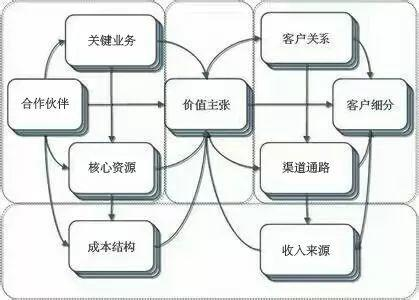

## 商业盈利模式

#### 在开源开放的条件下，使用p2p的Peer，大家还能赚钱吗？有动力和资源去打造并维护这个p2p信息社会吗？  
> 开源不等于开放  
> 开源告诉你怎么做，但不一定让你接入系统。要用自己搭建。  
> 例如：webrtc  
> 
> 开放则可以和你对接，但你自己内部怎么做不管，我内部怎么做不说，只说怎么对接。  
> 例如：微信小程序  
> 
> 开源开放就是平台告诉你怎么对接，并让你对接。

开源开放，是加解密安全的方法，是p2p通讯协议，是针对涉及数据、网络和安全方面的代码和协议。并不包括人脸识别算法、数字水印、数据分析工具、数据搜索引擎等等。  
数据的存储地点，网络通讯的安全，一直是各国政府关心的国家安全问题。开源开放有利于产品进入国际市场。  
* Peer个人：卖个人数据、卖知识经验、自媒体、开网店；
* 芯片厂商：做方案，卖芯片；和现在卖手机没什么区别。手机里面可以装私有的东西，但手机和别人通讯都采用4G统一的标准通讯，可以是开源的Android平台。
* 设备厂商：做加工，卖设备；
* 软件厂商：卖AI算法、卖数据分析工具；
* 互联网公司：卖云存储、做基础网络服务、做中介、买数据来分析再卖结果卖评级等等。


#### 

| 商业模式要素   | IPC-NVR套装 |
|:---- |:---- |
| 价值主张（VP） | 向终端用户提供安防监控/数据存储/加密通讯/身份认证/分享服务等能和手机互动的软件功能 |
| 合作伙伴（KP） | 安防板卡商/细分领域解决方案商/整机厂 |
| 渠道通路（CH） | 代理商/电商 |
| 客户关系（CR） | 用户觉得好用后口碑传颂/优质内容分享需要 |
| 关键业务（KA） | 提供开源代码 |
| 核心资源（KR） | 芯片保证加密 |
| 客户细分（CS） | 一般家庭/便利店/加油站 |
| 成本结构（C$） | 软件开发 |
| 收入来源（R$） | 芯片销售/板卡销售/整机销售  |

```
人人平等，世界和平
```

[回到主页](http://jamesfan007.github.io/)

---

#### 原创声明：

##### 所有文章均为原创。 <br/> 如果引用，必标明出处；若为转贴，定附上链接。

###### 作者：James Van <br/> 链接：http://jamesfan007.github.io/ <br/> 代码：https://github.com/jamesfan007/jamesfan007.github.io <br/> 联系：mail:[jamesfan007@hotmail.com]  <br/> &emsp;&emsp;&emsp;wechat:[CleverDogMaster]

---
