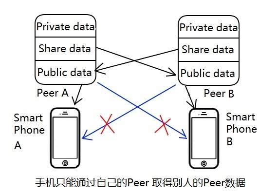

## Peer的重要属性

#### 去中心化的p2p

>  **为什么要去中心化？**  
>  去中心化就是私人对其Peer有绝对的拥有权和管理权，Peer不属于任何一家公司和组织，不需要注册和登录他们的账号。没有中心服务器管理p2p，就不会被管理服务器封杀，被切断与其它Peer的联络。  
>  **无中心服务器，Peer如何找到对方？**  
>  没有中心服务并不是说完全没有服务器，而是不绑定在某个服务器。<br/> 双方可以约定委托某个服务器作为双方地址查询和数据转发的代理。或者将自己的IP发布在某个公开网站，广而告之，让其它Peer能找到自己。如果一家的服务器不行，可以随时换。或同时在多家服务器上登记。  
> 用一个现实生活的比喻：双方好友，搬家时(IP地址改变)及时通知对方；知道对方姓王，到王家村的村委会(公共服务器)上去查询；或找可能认识他的同村人打听，一个问一个，最终可以询问到。要想快速找到对方，就加好友。  
> 参考:[p2p网络搜索技术](./docs/20190219_search.html).文章转自:区块链大师

#### 分布式存储
> **为什么要分布式存储？**  
> * **容量问题：** 因为Peer放不了那么多东西，家用的NVR/NAS的硬盘可能损坏。  
> * **安全问题：** 那为什么不直接全部放到云端？直接未加密数据放云端，有安全性问题。受云存储服务商的管控和限制，云存储服务商可以查看。文件系统为云服务商的，数据分类管理和检索依赖云服务商。  
> * **带宽问题：** 需要分享的和高频被访问的数据，放云端有较大的带宽和I/O能力。Peer只管理目录和权限。  
> **分布式存储，并不是排斥集中式云存储。**  
> 所有数据由个人的Peer去管理和加密，再切成碎片分布式存放在本地硬盘和第三方云端。对使用者来说是统一的，同一个文件系统。  
> **分布式存储，Peer会自动同步和缓冲。**  
> 对使用者来说，不必关心具体存在那个物理位置。对于安全性要求高的，才会保存在移动存储设备上，按需接入系统使用。  

#### 非对称的数据加密和电子水印
> **硬件固化的私钥**  不可被代码漏洞攻击而获取，也难以通过芯片逆向工程读出。仅在加解密硬件单元使用。   
> **硬件的加解密引擎**  加解密处理时间快，能满足实时视频流处理需求。  
> **硬件的电子水印叠加** 能标记并追溯信息的来源。

#### 带ImageSensor可以图像处理<br/>以及用于定位的辅助传感器
> **实时可视通话**  能和Peer使用者进行可视通话。  
> **带活体人脸识别**  能对Peer使用者进行身份认证和绑定。  
> **二维码识别** 通过手机显示动态二维码方式将使用者手机和Peer绑定，仅限于现场操作，避免他人的手机入侵。  
> **带Radio接收**  选配wifi/FM接收等传感器，这些传感器可来自绑定的手机。用于对Peer所处的城市/位置等检测。  
这些措施都是为了确定peer的使用者是谁，在哪里，用哪部手机操控。  

#### Peer既是个人客户端，又是个人服务器
> **Peer作为客户端:** 可以从云端上传下载文件，访问其他人Peer共享数据。  
> **Peer作为服务器:** 可以让Peer拥有者的手机访问浏览，Peer可以让其他人的Peer访问。   
>  Peer的存储空间分成三部分：  
> * **一部分是存放自己的私密数据的空间；** 仅允许自己手机本地访问。通过peer的摄像头扫手机显示的peer动态二维码，保证访问时手机与peer在同一地理位置。  
> * **一部分是存放自己的可共享数据的空间；** 允许自己手机访问远程访问；在自己peer授权下允许其它peer远程访问。  
> * **一部分是存放他人共享给自己数据的公共空间；** 允许自己手机访问远程访问；允许第三方peer远程未经自己peer授权状况下访问。由原数据peer授权即可。  
> 公共空间存储的是自己Peer访问别人的Peer所获取的文件和缓冲，可以加速自己的手机的浏览。也用于加速第三方peer访问同一数据。  
> 数据的交换，仅限于peer之间通过签名加密后进行。  

#### 

```
人人平等，世界和平
```

[回到主页](http://jamesfan007.github.io/)

---

#### 原创声明：

##### 所有文章均为原创。 <br/> 如果引用，必标明出处；若为转贴，定附上链接。

###### 作者：James Van <br/> 链接：http://jamesfan007.github.io/ <br/> 代码：https://github.com/jamesfan007/jamesfan007.github.io <br/> 联系：mail:[jamesfan007@hotmail.com]  <br/> &emsp;&emsp;&emsp;wechat:[CleverDogMaster]

---
