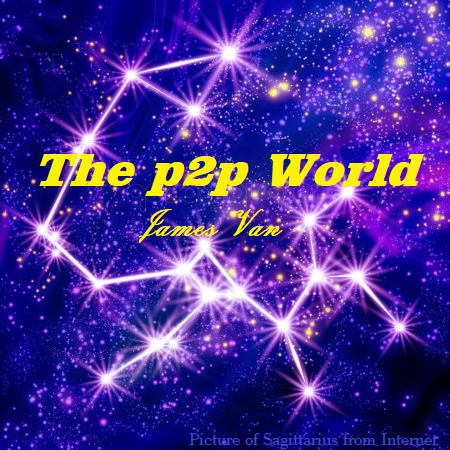
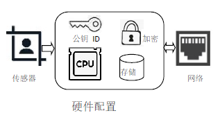
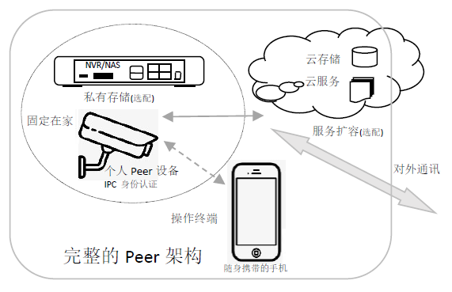

> 为什么写这文章？...[展开](./docs/20190218_about.html).

# The p2p world!

## 前言
#### 这是一个故事讲述如何构建人与人(person to person)之间，直接点对点(peer to peer)通讯，自由交流、人人平等、数学信任的信息社会。试图探讨信息与金融、人性与数学、科学与哲学。是一个理工男苦苦追寻的理想！In the p2p world,we only trust in Math!

## 背景
#### 在如今的互联网社会，存在商业垄断、隐私泄露、谣传骚扰、网络诈骗等诸多风险。人们对分享、隐私、监管、封禁以及信用等的需求，相互关联又可能相互矛盾。该如何应对？...[展开](./docs/20190218_background.html).

## 理想
#### 理想是构建一个基于数学算法信任的、开源开放通讯协议的、去中心化的p2p信息社会。人人都拥有一个通讯设备peer，通过同一个开源的p2p通讯协议，在网络世界里交流交易、查询查证、存储分享各种信息。实现开源开放、互联互通、人人平等、没有垄断、数学信任。

### 这里的"p2p"是什么意思？
#### 在这里讲的p2p是指每个人都拥有一个既是服务器又是终端机的通讯设备pear，使用开源开放通讯协议，可以人与人之间，直接点对点通讯交流交易。分布式计算和存储，无需中心服务器管理。这里的"p2p"有(peer to peer)、(person to person)和(partner to partner)多重意思... [展开](./docs/20190219_p2p.html).

### "数学信任"是什么意思？
#### “In Math We Trust”，用超过现有计算能力的数学难题达到不可伪造和欺骗的目的。被大家玩坏了的比特币，就是靠挖掘数学哈希碰撞的困难和椭圆曲线离散对数难题(ECDLP)，实现不可伪造。RSA等非对称加密及数字签名，就是可以数学信任。... [展开](./docs/20190219_math.html).

### 基于数学信任的p2p信息社会,具体又是啥？
#### 基于数学信任的p2p信息社会，就是人人都拥有一个私人的既是服务器又是终端机的通讯设备peer，用同一个开源开放的无中心p2p通讯协议，在网络世界交流、发布、存储、检索、查证信息。无论是电话、邮件、即时通讯、自媒体发布、还是网购交易、出行和健身，都使用Peer。Peer能证明主人的身份、记录个人的隐私、发布可靠的信息、管控别人访问的权限。手机不是Peer,只能是Peer输入输出控制台!... [展开](./docs/20190218_definitions.html).

## 网络架构发展史
#### 这个听起来似乎有点理想化的信息社会。大家不禁会说，怎么可能!大家怎么愿意接受并使用同一个通讯协议的软件。然而，纵观互联网的发展历史，这个理想的p2p通讯社会也不是不可能实现的... [展开](./docs/20190218_history.html).

## Peer介绍
### Peer的基本功能
#### 硬件设备必须具备的功能
1. 拥有唯一的公钥作为ID身份识别。私钥保存芯片内部，只能在加密电路中使用，无法直接读取私钥。一个人可能拥有多个ID，以不同的身份出现在不同场合。
2. 有一定的计算能力，能加解密、分析和统计个人数据。
3. 有一定的存储容量，能存储文件、照片及视频等个人数据。
4. 有一定的带宽联网，能24小时不间断的接入互联网，让别的Peer随时访问。
5. 有一定的输入传感器，用于对终端使用者的身份进行生物特征识别和行为特征识别。
   

#### 软件协议必须具备的功能
1. 使用同一个开放的无中心p2p协议。能与其它任何已知ID的其它Peer建立网络连接，交换数据。
2. 有一个分布式存储文件系统，能将不同设备不同地方存储的文件统一管理起来。自动同步，数据加密，分权限管理。
3. 有数据库和搜索引擎，能记录交易数据、统计分析、查询检索等。
4. 有相关的指纹、语音、人脸、步态、操作习惯等生物识别算法，能识别使用者身份,将人与Peer绑定。
5. 有HTML5网页或别的远程UI，通过手机电脑等智能设备向别人呈现易于浏览交互的内容。访问别人发布的信息，是通手机访问自己的Peer,在由自己的Peer向对方的Peer请求获得，通讯过程加密。对使用者来说，看起来是浏览器访问别人的网站。
   

### Peer的产品形态
> 符合个人终端peer产品定义的设备，大家想当然觉得就是手机。手机的网络连接是间歇工作的，无法让别人通过网络随时访问自己的手机。电脑、电视、机顶盒、路由器、网络磁盘NAS，都由于各种原因，不是最佳的个人peer终端产品。
#### 目前看来摄像头IPC/硬盘录像机NVR是最合适作为个人peer终端的一个电子产品形态。... [展开](./docs/20190218_production.html).

### Peer的网络架构

>
> IPC是Peer真正物理实体设备。  固定在家或公司，24小时提供服务。可以通过人脸识别、实时可视通话等方式对使用者身份认证和绑定；位置固定，可以通过IP地址和周边电磁指纹等确定和追溯地理位置；通过peer上的公开数据，与其他人的交易交流记录，可以确定使用者的朋友圈或工作圈。也就是说，可以通过peer确定对方是谁、在哪里、干什么的。
>
> NVR或NAS扩展私人存储空间。  数据由IPC提供加密和分布式存储管理。NVR/NAS的重要数据加密备份在第三方的云存储空间。数据自动同步，IPC看到的是同一份数据。有效对抗数据的灭失或窃取的风险。第三方的云存储服务商无法查看peer数据。
>
> 手机是进行交流交易的操作终端。  身份认证由IPC处理，信息存储在IPC，因为手机有遗失风险，被黑客入侵风险。IPC的软件功能可以比较单一，不会安装外来程序，可以将安全性提高。目前广泛使用的短信身份验证，都是假设手机使用者就是本人，假设手机卡没有被盗用，风险较高。
>
> 第三方云服务托管数据和缓冲服务。  若使用者有大量数据需要分享，并拥有大量粉丝，则可以将分享的数据托管在第三方云服务器上，数据的所有权和访问权限的管理，仍然由peer处理。访问者的Peer要先与被访问者的Peer握手。Peer与云服务只是一个负载均衡关系，没有依附关系。Peer的云服务对其它Peer的访问是透明和无感的。

### Peer的重要属性
> #### 去中心化的p2p
> ##### 为什么要去中心化？
> 去中心化就是私人对其Peer有绝对的拥有权和管理权，Peer不属于任何一家公司和组织，不需要注册和登录他们的账号。没有中心服务器管理p2p，就不会被管理服务器封杀，切断与其它Peer的联络。
>
> ##### 无中心服务器，Peer如何找到对方？
> 没有中心服务并不是说完全没有服务器，而是不绑定在某个服务器。  双方可以约定委托某个服务器作为双方地址查询和数据转发的代理。或者将自己的IP发布在某个公开网站，广而告之，让其它Peer能找到自己。如果一家的服务器不行，可以随时换。或同时在多家服务器上登记。 
> 打比方：双方好友，搬家时(IP地址改变)及时通知对方；知道对方姓王，到王家村的村委会(公共服务器)上去查询；或找可能认识他的同村人打听，一个问一个，最终可以询问到。要想快速找到对方，就加好友。
>
> #### 分布式存储
> ##### 为什么要分布式存储？
> 容量问题：因为Peer放不了那么多东西，家用的NVR/NAS的硬盘可能损坏。 
> 安全问题：那为什么不直接全部放到云端？直接未加密数据放云端，受云存储服务商的管控和限制，云存储服务商可以查看，而且文件系统为云服务商的，数据分类管理和检索依赖云服务商。 
> 带宽问题：需要分享的和高频被访问的数据，放云端有较大的带宽和I/O能力。Peer只管理目录和权限。
> 
> ##### 分布式存储，并不是排斥集中式云存储。
> 而是所有数据由个人的Peer去管理和加密，再分布式存放在本地硬盘和第三方云端。对使用者来说是统一的，通一个文件系统。
> ##### 分布式存储，Peer会自动同步和缓冲。
> 对使用者来说，不必关心具体存在那个物理位置。对于安全性要求高的，才会保存在移动存储设备上，按需接入系统使用。
#### Peer的P2P分布式计算和云计算的关系
#### 云端的虚拟Peer和家里的实体Peer区别

### Peer的应用场景
#### 社区便利店 
#### 中介服务机构
#### 网络互助组织
#### 互联网教育
#### 互联网医疗
#### 政府组织使用

### Peer的使用价值
#### 使用Peer处理电子交易的意义
#### 使用Peer发布自媒体的意义
#### 使用Peer如何建立征信体系
##### 使用Peer如何身份认证，如何"实名制"，如何一个人拥有多重身份。
##### 使用Peer如何防止刷单，如何防止恶评
##### 使用Peer如何避免网络欺诈和追寻欺诈人员
#### 使用Peer如何保护隐私与分享。
> 如果隐私无法完全避免被他人查看，则至少要知道是谁在查看；且对等地，他的相同隐私必须交换。
> 一个人要查我的身份证号码，我必须知道他的身份证号码。
> 我的活动踪迹被他人实时掌握，我必须知道他在哪里，数据拿来干什么。  

#### 使用Peer如何防止封杀，如何防止谣言，如何防止骚扰
#### 使用Peer如何存储个人照片等文件，如何同步，如何分类，如何查询

## 信息、交易与电子金融

## 隐私、共享与征信体系

## 自由、垄断与政府监管

## 如何人人拥有并愿意使用Peer?
> 这是个鸡生蛋，蛋生鸡的问题。...
  
## 商业盈利模式
> 在开源开放的条件下，使用p2p的Peer，大家还能赚钱吗？有动力和资源去打造并维护这个p2p信息社会吗？...
  
## 现有互联网公司存在价值和发展方向

## 现行法律风险及未来立法方向

[回到主页](http://jamesfan007.github.io/)

---

#### 原创声明：
##### 所有文章均为原创。   如果引用，必标明出处；若为转贴，定附上链接。
###### 作者：James Van   链接：http://jamesfan007.github.io/   代码：https://github.com/jamesfan007/jamesfan007.github.io   联系：mail:[jamesfan007@hotmail.com]    &emsp;&emsp;&emsp;wechat:[CleverDogMaster]

---
