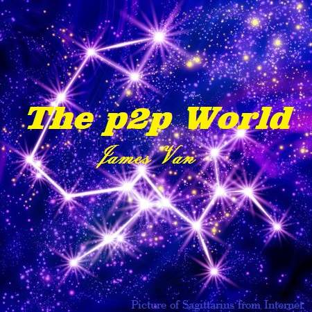
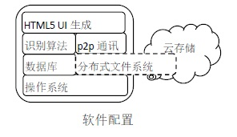
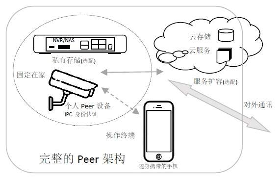
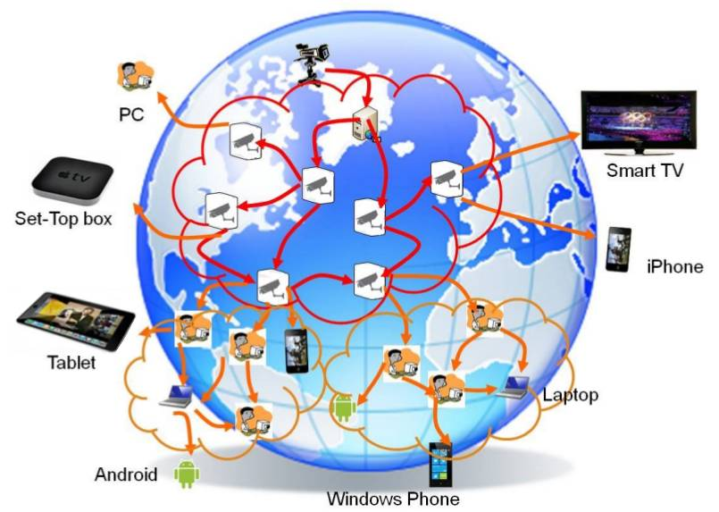

> 为什么写这文章？...[展开](./docs/20190218_about.html).

# The p2p world!

## 前言
这是一个讲述在网络世界里，构建一个人与人(person to person)之间，直接点对点(peer to peer)通讯，自由交流、信息对称、权利对等、数学信任的信息社会。试图探讨信息与金融、人性与数学、科学与哲学。这是一个理工男苦苦追寻的理想网络世界！

## 背景状况
在如今的移动互联网时代，存在商业垄断、隐私泄露、谣传骚扰、网络诈骗等诸多风险。人们对分享、隐私、监管、封禁以及信用等的需求，相互关联又可能相互矛盾。该如何应对？...[展开](./docs/20190218_background.html).

## The p2p world！
理想是构建一个基于数学算法信任的、开源开放通讯协议的、去中心化的p2p信息社会。人人都拥有一个通讯设备peer，通过同一个开源的p2p通讯协议，在网络世界里交流交易、查询查证、存储分享各种信息。实现**开源开放、互联互通、人人平等、没有垄断、数学信任**。

### 这里的"p2p"是什么意思？
在这里讲的p2p是指每个人都拥有一个既是服务器又是终端机的通讯设备peer，使用开源开放通讯协议，可以人与人之间，直接点对点通讯交流交易。分布式计算和存储，无需中心服务器管理。这里的"p2p"有(peer to peer)、(person to person)和(partner to partner)多重意思...[展开](./docs/20190219_p2p.html).

### "数学信任"是什么意思？
“In Math We Trust”，用超过现有计算能力的数学难题达到不可伪造和欺骗的目的。被大家玩坏了的比特币，就是靠挖掘数学哈希碰撞的困难和椭圆曲线离散对数难题(ECDLP)，实现不可伪造。RSA等非对称加密及数字签名，就是可以数学信任。... [展开](./docs/20190219_math.html).

### 基于数学信任的p2p信息社会,具体又是啥？
基于数学信任的p2p信息社会，就是人人都拥有一个私人的**既是服务器又是终端机的通讯设备Peer**，用同一个开源开放的无中心p2p通讯协议，在网络世界交流、发布、存储、检索、查证信息。无论是电话、邮件、即时通讯、自媒体发布、还是网购交易、出行和健身，都使用Peer。Peer能证明主人的身份、记录个人的隐私、发布可靠的信息、管控别人访问的权限。手机不是Peer,只能是Peer输入输出控制台!...[展开](./docs/20190218_definitions.html).

## 网络架构发展史
这个听起来似乎有点理想化的信息社会。大家不禁会说，怎么可能!大家怎么愿意接受并使用同一个通讯协议的软件。然而，纵观互联网的发展历史，这个理想的p2p通讯社会也不是不可能实现的...[展开](./docs/20190218_history.html).

## Peer介绍
### Peer的基本功能
**Peer硬件设备**必须具备计算、存储、网络、传感、加密五大功能。  
传感指的是用于人的生物特征识别的图像传感器和用于定位的GPS/无线电等。  
加密指的是数据加密引擎（RSA/AEC等）和数字水印(watermark)及可信执行环境(TEE)。  
**Peer硬件成本**，不考虑数据存储空间，应该控制在￥300以内，便于推广普及Peer。  
     

**Peer软件协议**必须具备无中心p2p网络、分布式加密存储、数据搜索分析引擎、生物特征识别算法、远程可视化访问服务等五大功能。  
**Peer软件开发难度**,主要在于分布式加密存储、数据搜索分析引擎等AI化算法上。
     
...[展开](./docs/20190224_function.html).

### Peer的产品形态
**Smart Phone is not Peer！** 符合个人peer产品定义的设备，大家想当然觉得就是手机。但手机的网络连接是间歇工作的，无法让别人通过网络随时访问自己的手机。电脑、电视、机顶盒、路由器、网络磁盘NAS，都由于各种原因，不是最佳的个人peer终端产品。  
**现阶段摄像头IPC(+硬盘录像机NVR/NAS)是最合适作为个人peer设备的一个电子产品载体形态。**  
...[展开](./docs/20190218_production.html).

### Peer的网络架构
  
- **IPC是Peer真正物理实体设备。**  
- **NVR或NAS扩展私人存储空间。**  
- **手机是进行交流交易的操作终端。**  
- **第三方云服务托管数据和缓冲服务。**  
...[展开](./docs/20190224_structure.html).

### Peer的重要属性
- **去中心化的p2p** 获得信息对称和权利对等，避免垄断。
- **分布式存储** 扩大存储容量，防止信息丢失，加快信息分享。
- **非对称的数据加密和电子水印** 保证信息安全，保护隐私，追溯责任。
- **使用者身份识别和定位的功能** 确定使用者是谁，在哪里用什么设备操控，承担责任。  
- **Peer既是个人客户端，又是个人服务器**  
  
Peer作为服务器，可以让其他人的Peer随时访问，这是保证信息安全和权利对等的需要。也是一般个人设备不具备的重要属性。  
...[展开](./docs/20190224_feature.html).

### Peer的应用场景
- 自媒体发布
- 社区便利店
- 中介机构
- 网络互助组织
- 网络教育
- 网络医疗
- 政府组织使用  
...[展开](./docs/20190226_application.html).  

## 隐私、分享与征信体系
**隐私是当事人不愿意他人知道的个人信息**，隐私权是一个人格尊严的体现。隐私权包括个人信息不被搜索的"**被遗忘权**"，和个人选择"**阅后即焚**"，不转发和保存信息的权利。  
**隐私权的保护范围受公共利益和法律规定的限制；**  
**隐私得到保护可以使人获得安全感；**  
**让渡一些隐私权可以换取他人利益；**  
**公开隐私容易得到他人信任**。  

**保护隐私应该建立信息对称和权利对等的原则。**一个人在现代信息社会的活动中，难以保证绝对的隐私安全。应该通过技术手段尽最大可能保护自己的隐私权不受侵犯。重要的是，保护隐私应该建立信息对称和权利对等的原则。如果隐私信息必须提供给他人查看，则希望对等地，知道是谁在查看，而且他必须也提供对等的隐私来交换担保质押。无论是否涉及公共利益，均应该人人平等。**Peer与peer的信息对称和权利对等，信息传播和追踪都方便，违法成本和追责成本等价，极大地保护了隐私**。
- 使用Peer如何绑定个人，身份认证，如何"实名制"？  
- 使用Peer如何一个人拥有多重身份?  
- 使用Peer如何如何绑定非个人实体(公司法人/社团组织/政府机构)?  
- 使用Peer如何解决隐私、分享和公共利益的矛盾关系?  
- 使用Peer如何防止封杀，如何防止谣言，如何防止骚扰?  
- 使用Peer如何建立个人征信体系？  
- 使用Peer如何防止刷单，如何防止恶评?  
- 使用Peer如何避免网络欺诈和追寻欺诈人员?  
...[展开](./docs/20190223_private.html).

## 信息、交易与电子金融
**个人Peer给数据合法地购买收集提供了快捷方便的网络方式**。如果Peer得到广泛使用，各种交流和交易活动都是通过Peer来进行，那么就有机会通过Peer的信息了解供求关系，进行买卖撮合，进而产生电子金融，甚至形成电子货币。
...[展开](./docs/20190224_economics.html).

## 自由、垄断与政府监管
**在p2p世界里，政府监管机关也只是普通一个peer，内容的审查应该实行“民不举，官不究”原则**。  
**在p2p世界里，公司社团组织也只是普通一个peer，不再掌握个人数据，不再享有网络霸权地位，一切按市场规则来买卖交易**。  
...[展开](./docs/20190224_hegemony.html).

## 如何人人拥有并愿意使用Peer?
   这是个鸡生蛋，蛋生鸡的问题。首先要人们有Peer设备，才可能使用Peer功能；要觉得Peer功能有用，才会想购买peer设备。  
   **IPC是一个大家有使用需求，成本足够低廉的Peer功能搭载落地平台**。  
   **旧iphone手机等也可以改造成为廉价的peer**。  
...[展开](./docs/20190224_start.html).
  
## 商业盈利模式
在**开源开放的条件下**，使用p2p的Peer，大家还能赚钱吗？有动力和资源去打造并维护这个p2p信息社会吗？
- Peer个人：卖个人数据、卖知识经验、自媒体、开网店；
- 芯片厂商：做方案，卖芯片；
- 设备厂商：做加工，卖设备；
- 软件厂商：卖AI算法、卖数据分析工具；
- 互联网公司：卖云存储、做基础网络服务、做中介、买数据来分析再卖结果卖评级等等。  
...[展开](./docs/20190221_profit.html).

## 互联网公司存在的价值
**个人Peer掌握数据和自主进行互联互通交流交易**。现有的**互联网公司将转为网络基础服务商**，不再直接拥有用户终端及其数据。  
- 互联网公司可以向peer提供地址云储存、云计算、地址查询、数据转发等网络服务。 
- 也可以通过向Peer购买数据，用于市场分析、医学研究、AI训练等等大数据挖掘处理，再向peer提供搜索查询、买卖中介、研究咨询服务。
- 可以开发AI算法和数据分析工具，供给peer使用。  
...[展开](./docs/20190221_cloud.html).

## 法律风险
**个人Peer本质上是实时加密通讯设备**。虽然法律保护通讯自由和通讯秘密，但不少国家同时也规定使用高强度加密设备通讯，必须获得政府许可和接收监管。监管意味着交出密钥，Peer就失去了意义。如何决解个人隐私权和政府监管权矛盾问题值得思考。
...[展开](./docs/20190221_law.html).

[回到主页](http://jamesfan007.github.io/)

---

#### 原创声明：
##### 所有文章均为原创。   如果引用，必标明出处；若为转贴，定附上链接。
###### 作者：James Van   链接：http://jamesfan007.github.io/   代码：https://github.com/jamesfan007/jamesfan007.github.io   联系：mail:[jamesfan007@hotmail.com]    &emsp;&emsp;&emsp;wechat:[CleverDogMaster]

---
